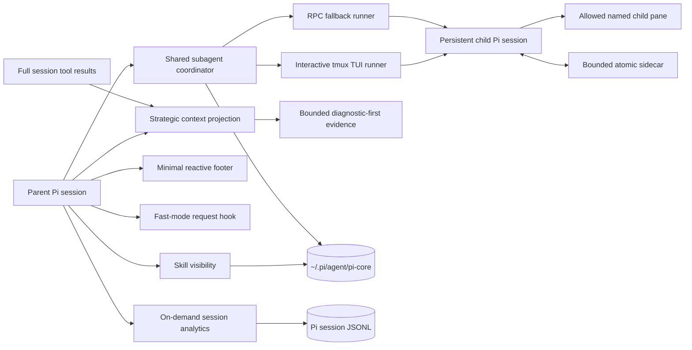

<p align="center">
  <h1 align="center">π Core</h1>
</p>

<p align="center">
  <strong>A lean control layer for the Pi coding agent.</strong>
</p>

<p align="center">
  <a href="https://github.com/enzodevs/pi-core/actions"></a>
  <a href="package.json"></a>
  <a href="LICENSE"></a>
</p>

<p align="center">
  <a href="#quickstart"><strong>Quickstart</strong></a> ·
  <a href="#skill-visibility"><strong>Skills</strong></a> ·
  <a href="#session-analytics"><strong>Analytics</strong></a> ·
  <a href="#background-subagents"><strong>Subagents</strong></a> ·
  <a href="#background-processes"><strong>Processes</strong></a> ·
  <a href="#ask-the-user"><strong>Questions</strong></a> ·
  <a href="#temporary-sudo"><strong>Sudo</strong></a> ·
  <a href="#minimal-footer"><strong>Footer</strong></a> ·
  <a href="#interstellar-theme"><strong>Theme</strong></a> ·
  <a href="#idle-recap"><strong>Recap</strong></a> ·
  <a href="#openai-fast-mode"><strong>Fast mode</strong></a> ·
  <a href="CONTEXT-HYGIENE.md"><strong>Context hygiene</strong></a>
</p>

**Pi Core** is a lean, Node-native control layer for [Pi](https://pi.dev): per-project skill visibility, durable memory, session analytics, portable background subagents and processes, focused TUI improvements, and an OpenAI Codex Fast mode toggle. It is designed around one constraint most agent tooling treats as an afterthought: **everything placed in context has a recurring cost**.

No polling loop. No sprawling always-active tool catalog. Variable output is bounded, and intermediate work stays outside the parent context.

## Why Pi Core

| Problem | Pi Core's answer |
| --- | --- |
| Every skill inflates every prompt | Choose `full`, `name`, `searchable`, or `off` per working directory |
| Old sessions are hard to inspect | Search transcripts and report cost, errors, models, and prompt patterns on demand |
| Fast mode requires restarting or hidden config | Toggle priority processing live with `/fast` |
| Tool catalogs grow without discipline | Enforce a written context-hygiene policy for schemas and outputs |

## Highlights

- **Exact-CWD skill profiles** — sessions in the same directory share one visibility policy.
- **Searchable skill catalog** — hide metadata from the prompt while retaining on-demand discovery.
- **Read-only session analytics** — inspect cost, transcripts, errors, and prompt patterns without an always-active tool.
- **Strategic context guard** — preserve full session/TUI output while projecting bounded, diagnostic-first tool evidence to models.
- **Observable background subagents** — run real interactive Pi TUI children in tmux, with bounded sidecar delivery and an RPC fallback outside tmux.
- **Bounded background processes** — watch finite CI gates or run persistent services with rotating searchable logs and direct TUI control.
- **Interactive questions** — ask for bounded free text, one choice, or multiple choices without guessing.
- **Temporary sudo** — approve each privileged command and enter a masked password that exists only in session memory.
- **Provider-scoped Fast mode** — injects `service_tier: "priority"` only for OAuth-backed `openai-codex` requests.
- **Responsive minimal footer** — model, thinking, branch, context, cost, and extension state without render-time I/O.
- **Interstellar theme** — a high-contrast deep-space palette, orbital π startup art, and a restrained animated working indicator.
- **Ephemeral idle recap** — after three quiet minutes, show one tool-free sentence describing where the conversation stopped.
- **Automatic session titles** — name new sessions from their first completed exchange without touching conversation history.
- **Node-first TypeScript** — no Bun runtime APIs and no runtime framework beyond Pi's extension surface.

## Quickstart

### Requirements

- Node.js 20 or newer
- A working Pi installation

### Install from GitHub

```bash
pi install git:github.com/enzodevs/pi-core
```

Reload an existing Pi session after installation:

```text
/reload
```

For local development:

```bash
git clone https://github.com/enzodevs/pi-core.git
cd pi-core
npm install
pi install "$PWD"
```

Pi Core stores mutable state under `~/.pi/agent/pi-core/`. It never modifies discovered skill files.

## Skill visibility

Pi Core controls how much information each skill contributes to model context. Settings layer from the global default, through global per-skill overrides, to project overrides. Git repositories use a stable project root (linked worktrees share the main checkout); outside Git, the exact working directory is used.

| Mode | Always-visible context | Searchable | Loadable |
| --- | --- | :---: | :---: |
| `full` | Name, description, and location | ✓ | ✓ |
| `name` | Name only | ✓ | ✓ |
| `searchable` | Nothing | ✓ | ✓ |
| `off` | Nothing | — | — |

Open the interactive manager:

```text
/skill-manager
```

Or update one skill directly. Project scope is the default; `inherit` removes an override:

```text
/skill-manager evidence-first-code-review searchable
/skill-manager evidence-first-code-review inherit
/skill-manager --global brave-ui-qa off
/skill-manager --global brave-ui-qa inherit
```

`/skill-manager` opens at project scope and `/skill-manager --global` opens at global scope. Inside either view, Tab or Shift+Tab switches between the project and global tabs. Use Up/Down to navigate skills, Left/Right or Enter/Space to change modes, Home/End or Page Up/Page Down to jump, and Escape to close. The manager shows whether each effective value comes from the project, a global override, or the default, and adapts its detail and row count to the terminal size.

The model receives two compact tools for enabled skills:

- `search_skills` — search capability metadata without exposing the whole catalog.
- `load_skill` — load one exact skill when its full procedure is needed.

Profiles and the generated metadata index live at:

```text
~/.pi/agent/pi-core/skill-manager.json
~/.pi/agent/pi-core/skill-index.json
```

## Memory context

Pi Core integrates with the portable `agent-memory` CLI without adding an always-active model tool. On the first submitted prompt of each session, it makes exactly one retrieval attempt across project and global memory and injects at most two results above the calibrated `0.84` admission threshold as hidden, explicitly untrusted historical evidence. The handoff is capped at 1.5 KiB and persists in session context; later turns never repeat retrieval.

On genuine session shutdown (`quit`, `new`, `resume`, or `fork`), Pi Core only enqueues an append-only session checkpoint; extension reloads are ignored. Checkpoints record an immutable prefix hash and byte range, so later appends do not invalidate prior evidence and subsequent jobs process only the new suffix. A persistent systemd user timer runs daily around 03:15 and invokes one `openai-codex/gpt-5.6-terra` process at medium reasoning for up to eight pending jobs. Before Terra sees evidence, `agent-memory journal render` follows the active branch and emits at most 32 KiB of user text and assistant final text; thinking, tool calls/results, custom injections, malformed records, and previously processed prefixes are excluded. A private lock prevents concurrent consolidators, the run is capped at 15 minutes, and a dedicated system prompt requires all memory writes to pass through the validated CLI. Project and global candidates apply autonomously after deterministic validation, contradictions must use supersession, and automatic hard deletion is unavailable. Shutdown reconciliation terminalizes analyzed jobs whose candidates are already terminal. `agent-memory` remains responsible for Markdown truth, SQLite FTS/vector indexes, temporal metadata, candidates, provenance, stale-source checks, maintenance metrics, and atomic application.

Pi Core initializes an empty project root on first use; linked Git worktrees share the main checkout's root through `git-common-dir`, so parent and subagents see the same durable memory. If `agent-memory` is missing or retrieval fails, Pi continues without injected context. `/memory-status` shows bounded queue metrics; manual maintenance remains available through the portable agent-memory skill and CLI.

## Session analytics

The bundled `analyze-sessions` skill provides read-only, on-demand scripts over Pi's saved JSONL sessions. It can report cost by day, project, model, or session; search old user and assistant messages; render a session as Markdown; and extract prompts for recurring-pattern analysis. Subagent costs are included in cost totals by default, while transcript and prompt queries exclude child sessions unless requested.

The skill adds no always-active model-facing tool. Ask Pi questions such as “what did Pi cost this week?”, “find the session about rate limits”, or “show where recent sessions hit tool errors.”

## Strategic context guard

Pi Core keeps original tool results in the session and TUI, but projects a smaller evidence view immediately before every model call. A 24 KiB rolling budget prioritizes unseen output: every result in a parallel batch gets a fair first-delivery allowance, rather than treating earlier completions as history. Results that fit pass through unchanged, without redundant artifact receipts. Oversized results keep source-ordered, non-overlapping evidence windows with explicit gaps; failure evidence takes priority over routine status lines, and repeated braces or blank lines retain their structure. Older results shrink once the model has seen them. The same extension is explicitly loaded in interactive and RPC subagents.

Compression is deterministic and model-free. It never changes files, tool execution, human-visible history, images, or assistant/user messages. Results above the 1,200-byte historical allowance are additionally copied into a private session-owned artifact store under `~/.pi/agent/pi-core/context-artifacts/`; when Pi exposes a complete-output path, the store copies it before the temporary file can disappear. Compressed projections carry an opaque artifact ID, and a single `context_lookup` tool is activated only after an artifact exists. Supply either `query` for ranked evidence or `offset` for a contiguous stored-line range; `limit` is bounded at 80, with a 4 KiB response cap. Search reports total versus shown hits; ranges report continuation; both disclose incomplete stored prefixes. Stored line numbers are not filesystem line numbers, and overflow artifacts may contain more output than the original displayed result. Retrieval cannot cross session ownership and does not recursively archive its own excerpts. Artifacts are capped at 8 MiB each, 128 MiB total, 512 files, and seven days. Storage remains file-backed; RTK and an analytics database are not runtime dependencies. See [the RTK evaluation](docs/rtk-evaluation.md) for measured trade-offs. `/context-guard` reports the latest projection ratio and artifact count. This selective, relevance-aware policy follows evidence that indiscriminate long context can reduce retrieval performance ([Lost in the Middle](https://aclanthology.org/2024.tacl-1.9/)) and that preserving key information outperforms uniform compression ([Concise and Precise Context Compression for Tool-Using Language Models](https://aclanthology.org/2024.findings-acl.974/)).

## Background subagents

Use `agent_control(action="catalog", query="GPT 6 Astra")` to discover agent profiles and matching available model IDs before delegation. The optional search matches provider, ID, and display name; results include omission counts (narrow the search when needed). Copy the exact `provider/model` into `background_agent.model` and pass `thinking` separately. Catalog discovery does not start agents or select a model automatically.

`background_agent` returns a short run ID immediately, leaving the parent free to continue. Writing profiles can declare `workspace: worktree`; Pi Core then provisions clean linked worktrees exclusively through [Worktrunk](https://worktrunk.dev/) and launches the child there. Install `wt` separately and keep it on `PATH` (for example, `cargo install worktrunk`). When the parent is inside a valid tmux pane, Pi Core opens a detached split containing the **actual interactive Pi TUI child**. Focus it with normal tmux navigation to observe, scroll, or interact with the child directly. Nested agents use the same backend selection, so an allowed child delegation opens another real pane. Outside tmux, or when pane launch fails before work starts, Pi Core preserves the isolated RPC backend.

Every child gets a persistent Pi session named `agent:<profile>:<run-id>`. Its session header links to the direct parent session, and a non-context custom entry records validated lineage. The child starts with extension discovery disabled, the Pi Core subagent extension loaded by absolute path, skills and prompt templates disabled, and an explicit tool allowlist. Profile tools remain restrictive; Pi Core adds only `ask_parent` and, when the pinned child policy permits nesting, `background_agent` plus `agent_control`.

Parent/child control never uses pane keystrokes or captured terminal output. A private `0700` sidecar beneath `~/.pi/agent/pi-core/subagents/runs/` carries atomic, ownership-checked question, reply, steering, cancellation, exit, and final-result records. This means human typing, focus changes, scrolling, and TUI rendering cannot corrupt automatic delivery. Thinking, tool transcripts, and pane contents never enter the parent; only one immutable UTF-8-bounded final assistant handoff is pushed durably.

A child receives the child-only `ask_parent` tool. It can send one concise blocking question, end its turn, and remain alive. While waiting, ordinary input in the child pane is held so the direct parent remains the answer authority. Reply from the parent with:

```text
agent_control(action="reply", id="<run-id>", message="<answer>")
```

`agent_control` also lists compact status, steers a running direct child through the sidecar, or cancels it. A parent cannot control grandchildren. Agent definitions opt into nested delegation with `children` frontmatter. The bundled `worker` and read-only `reviewer` may delegate to either role; depth and concurrency limits prevent recursive runaway.

```markdown
---
name: coordinator
description: Coordinates implementation and review
tools: read, bash
children: worker, reviewer
workspace: worktree
---
```

The bundled `worker` defaults to `workspace: worktree`; read-only profiles inherit their requested CWD. User or project profiles that override a bundled writer retain its workspace policy unless they explicitly declare `workspace: inherit`, so changing a model or prompt cannot silently disable isolation. Start results expose the effective profile source and workspace mode, and aggregate status includes bounded profile provenance. A caller may explicitly set `workspace: inherit` for a task that must see uncommitted parent state. Clean linked worktrees are reused, while a clean primary checkout receives a unique `pi-agent/<profile>-<run-id>` branch through `wt switch`. Dirty checkouts fail with recovery guidance rather than sharing mutable state or silently omitting uncommitted work. Top-level `vendor`, `node_modules`, and `.venv` paths that resolve outside a linked worktree are rejected. Dependency installation belongs in a blocking Worktrunk `pre-start` hook; asynchronous hooks can race the child launch. Start results and the worker runtime prompt report whether that hook completed, was absent, or was not rerun for a reused worktree, so the agent knows when it must verify dependencies. Pi Core retains created worktrees for review and integration instead of deleting evidence automatically.

Subagent starts are unlimited. Safety limits default to depth 3, six globally concurrent children, 8 KiB tasks, 12 KiB handoffs, 1 KiB questions, and 2 KiB replies. Aggregate `agent_control status` reports temporary global concurrency. Configure limits before Pi starts with `PI_CORE_SUBAGENT_MAX_DEPTH`, `PI_CORE_SUBAGENT_GLOBAL_CONCURRENCY`, `PI_CORE_SUBAGENT_TASK_BYTES`, `PI_CORE_SUBAGENT_HANDOFF_BYTES`, `PI_CORE_SUBAGENT_QUESTION_BYTES`, and `PI_CORE_SUBAGENT_REPLY_BYTES`. Root limits are pinned into descendant lineage so a child cannot raise them. Global leases are coordinated atomically beneath `~/.pi/agent/pi-core/subagents/`.

A settled TUI child seals its final handoff, shows a short completion notice, and exits automatically after a brief grace period. Closing a pane early fails that run; stopping it requests an abort and then force-closes an unresponsive pane. Parent branch changes and normal shutdown cancel owned children. `/reload` is different: live tmux children are detached from the retiring extension instance and reattached by the new one using their durable lineage, pane, session, and sidecar metadata. RPC children cannot be reattached and are terminalized safely on reload.

## Background processes

The `background_process` tool runs any shell command asynchronously without spending a model-backed child. Its required mode makes the lifecycle contract explicit:

- `wait` expects a terminal result, making it suitable for CI gates, deployments, and provider-native watchers such as `gh run watch <id> --exit-status`.
- `service` expects to remain alive, making it suitable for development servers, application log streams, and similar session-owned processes. An unrequested service exit is a failure even when its exit code is zero.

```text
background_process(
  command="gh pr checks 123 --watch --fail-fast",
  mode="wait",
  cwd="/path/to/repo",
  timeoutSeconds=1800
)

background_process(
  command="npm run dev",
  mode="service",
  cwd="/path/to/repo"
)
```

Each process receives a short ID. Combined stdout/stderr is retained beneath `~/.pi/agent/pi-core/processes/` in two private rotating 4 MiB segments, so noisy services cannot grow storage without bound. Unread completions stay local while the parent is busy, then arrive in a bounded batch after it settles. Each notification is at most 4 KiB, with a short excerpt per process; explicit `wait` reads retain the full bounded 4 KiB tail. Results already read through `wait` or a targeted terminal `status` are acknowledged persistently and are not replayed as new turns. A timed-out or cancelled wait, a running status, or a status listing does not consume a future completion. `process_control` keeps all model-facing inspection bounded:

| Action | Behavior |
| --- | --- |
| `status` | List recent processes, or inspect one process with its command and recent log tail; a terminal inspection acknowledges that result |
| `wait` | Await a result without polling; a completed read acknowledges it, including failures |
| `search` | Lexically search retained logs while a process is running or after it exits; returns at most 4 KiB of line-numbered context |
| `stop` | Terminate a running process and its process group |

Humans can use `/ps` to inspect session-owned processes and `/stop <id|all>` to terminate them directly from the TUI. State is persisted before terminal delivery, and pending results recover after reload. Active attached process trees stop on branch changes, `/quit`, and other session shutdowns; `service` mode is not OS-level daemonization, and commands that deliberately detach themselves are outside its ownership boundary. No polling model or unbounded log transcript enters context.

## Ask the user

The `ask_user_question` tool pauses work for exactly one user decision. Omit `options` for free text, provide `options` for single select, or add `multiSelect: true` for multi-select. Choice prompts always include **Other** for a custom response. In print/JSON mode it returns a definitive unavailable result instead of hanging; RPC supports free-text prompts, while choice UIs require the interactive TUI. Questions, context, options, and returned text are bounded before entering model context.

```text
ask_user_question(
  question="Which release target should I use?",
  options=[{ label="Staging (Recommended)" }, { label="Production" }]
)
```

Concurrent popup calls share one UI lock and are shown serially.

## Temporary sudo

The `sudo` tool runs one shell command with root privileges. Every call displays the exact command for approval. On first use, Pi opens a masked password dialog; the password stays only in extension memory and is reused for approved commands in the current session. It is never placed in tool arguments, output, session history, environment variables, or process arguments.

Privileged output is capped at the last 2,000 lines or 50 KiB. Larger output is written to a private temporary file. `/sudo-lock` forgets the credential immediately; session shutdown also clears it and invalidates sudo's timestamp. The tool is unavailable outside Pi's interactive TUI.

## Minimal footer

Pi Core replaces the default footer with a restrained, single-line status surface:

```text
◇ gpt-5.6-terra · low · git:main │                    ctx 18% · $0.14 · ⚡ fast
```

It displays the active model and thinking level, a renamed session's title, Git branch, context usage, and extension statuses such as Fast mode. Unnamed sessions show no title or session ID. The layout progressively drops optional title and branch details on narrow terminals while retaining core state.

Rendering performs no filesystem, Git, network, or history scans. Git updates use Pi's footer watcher, cost is accumulated from message events, and width-safe Unicode characters avoid a Nerd Font dependency.

## Interstellar theme

Pi Core includes an `interstellar` theme: a calm, high-contrast deep-space palette with ice-blue navigation, warm starlight headings, and explicit success/error surfaces. Its companion extension replaces Pi's startup header with orbital π art, sets a terminal title, and uses a subtle four-frame activity indicator. It adds no model-visible tools or prompts.

Select it once in Pi with `/settings` → **Theme** → `interstellar`, then run `/reload` in an existing session to apply the header extension. The theme is also discoverable from the installed package's `themes/` directory.

## Idle recap

After Pi settles and remains idle for three minutes, Pi Core generates one compact line of up to three terse phrases describing the task, progress, and immediate next step. It appears quietly below the editor and disappears when work resumes.

The recap prefers the authenticated `openai-codex/gpt-5.3-codex-spark` model at low reasoning and falls back to the active session model if Spark is unavailable or a Spark request fails. It exposes no tools and is never written to session history or added to model context. Stale or cancelled results are discarded. Pi extensions cannot observe raw editor keystrokes, so the timer resets on submitted input and agent/session activity rather than cursor movement.

## Automatic session titles

After the first completed user-assistant exchange, an unnamed session receives a concise title for Pi's session selector. Existing and manually assigned names are never overwritten. Generation uses only bounded excerpts from that first exchange, prefers authenticated `openai-codex/gpt-5.3-codex-spark` at low reasoning, and falls back to the active model. Failures are silent, requests are cancelled on new input or session changes, and the generated title is metadata rather than conversation history.

## OpenAI Fast mode

Toggle priority processing for the OAuth-backed `openai-codex` provider without restarting the session:

```text
/fast          # toggle
/fast on       # enable
/fast off      # disable
/fast status   # inspect
```

When enabled, subsequent Codex requests include:

```json
{
  "service_tier": "priority"
}
```

The official OpenAI Codex implementation uses the same request value for Fast mode. Pi Core applies it only when the active provider is `openai-codex`; other providers remain untouched. Priority processing may incur premium pricing.

State persists at:

```text
~/.pi/agent/pi-core/fast-mode.json
```

Benchmark priority versus default processing with randomized, balanced runs:

```bash
npm run benchmark:fast -- --model gpt-5.3-codex --runs 10
```

The benchmark keeps one `pi --mode rpc` process—and its OpenAI Codex websocket—alive for the full run. It performs one excluded warmup, cycles three short prompts by default in fresh logical sessions, reports median and p95 time to first text and `agent_end`, saves raw events and summaries as JSON, and restores the original Fast mode JSON. Repeat `--prompt "..."` to supply custom prompts. Do not change `/fast` or run another benchmark concurrently; the setting is shared by all Pi processes.

## Context hygiene

[`CONTEXT-HYGIENE.md`](./CONTEXT-HYGIENE.md) is an engineering contract, not an aspirational note. It adapts agent-interface principles from [AXI](https://axi.md/) to Pi extensions:

- minimize always-on schemas;
- keep intermediate work outside model context;
- truncate variable output with explicit size hints;
- pre-compute useful aggregates;
- push completion instead of polling;
- use compact formats when measurement justifies them;
- return conclusions rather than transcripts.

## Architecture



## Development

Development uses the latest Node.js 24 LTS pinned in `.node-version` (Node.js 22 remains the minimum supported development runtime); the published extensions remain compatible with Node.js 20.

```bash
make install
make check
```

Run `make help` to list the focused development targets. The Makefile is a thin, stable interface over the package-owned npm scripts, so local development, CI, and coding agents use the same commands.

`make check` runs:

- Biome formatting and lint checks
- strict TypeScript compilation
- Vitest unit tests
- gating Fallow dead-code analysis

Run `make health` for advisory complexity and maintainability signals, or `make pack` to run required checks and inspect the package tarball contents. Both Fallow commands disable its cache and leave the working tree unchanged.

Runtime source is loaded directly by Pi's TypeScript loader. Package releases include only extensions, documentation, and the license.

## License

[MIT](LICENSE) © Enzo Cambraia
