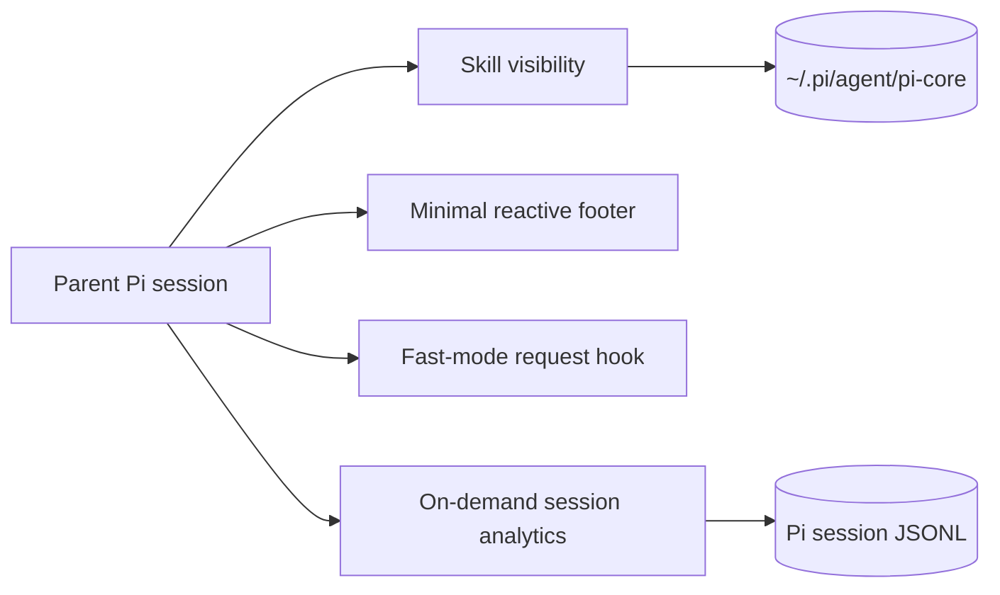

<p align="center">
  <h1 align="center">π Core</h1>
</p>

<p align="center">
  <strong>A lean control layer for the Pi coding agent.</strong>
</p>

<p align="center">
  <a href="https://github.com/enzodevs/pi-core/actions"></a>
  <a href="package.json"></a>
  <a href="LICENSE"></a>
</p>

<p align="center">
  <a href="#quickstart"><strong>Quickstart</strong></a> ·
  <a href="#skill-visibility"><strong>Skills</strong></a> ·
  <a href="#session-analytics"><strong>Analytics</strong></a> ·
  <a href="#background-monitors"><strong>Monitors</strong></a> ·
  <a href="#ask-the-user"><strong>Questions</strong></a> ·
  <a href="#temporary-sudo"><strong>Sudo</strong></a> ·
  <a href="#minimal-footer"><strong>Footer</strong></a> ·
  <a href="#interstellar-theme"><strong>Theme</strong></a> ·
  <a href="#idle-recap"><strong>Recap</strong></a> ·
  <a href="#openai-fast-mode"><strong>Fast mode</strong></a> ·
  <a href="CONTEXT-HYGIENE.md"><strong>Context hygiene</strong></a>
</p>

**Pi Core** is a lean, Node-native control layer for [Pi](https://pi.dev): per-project skill visibility, durable memory, session analytics, background monitors, focused TUI improvements, and an OpenAI Codex Fast mode toggle. It is designed around one constraint most agent tooling treats as an afterthought: **everything placed in context has a recurring cost**.

No polling loop. No sprawling always-active tool catalog. Variable output is bounded, and intermediate work stays outside the parent context.

## Why Pi Core

| Problem | Pi Core's answer |
| --- | --- |
| Every skill inflates every prompt | Choose `full`, `name`, `searchable`, or `off` per working directory |
| Old sessions are hard to inspect | Search transcripts and report cost, errors, models, and prompt patterns on demand |
| Fast mode requires restarting or hidden config | Toggle priority processing live with `/fast` |
| Tool catalogs grow without discipline | Enforce a written context-hygiene policy for schemas and outputs |

## Highlights

- **Exact-CWD skill profiles** — sessions in the same directory share one visibility policy.
- **Searchable skill catalog** — hide metadata from the prompt while retaining on-demand discovery.
- **Read-only session analytics** — inspect cost, transcripts, errors, and prompt patterns without an always-active tool.
- **Model-free background monitoring** — watch CI, deployments, or long commands and receive one durable completion without polling.
- **Interactive questions** — ask for bounded free text, one choice, or multiple choices without guessing.
- **Temporary sudo** — approve each privileged command and enter a masked password that exists only in session memory.
- **Provider-scoped Fast mode** — injects `service_tier: "priority"` only for OAuth-backed `openai-codex` requests.
- **Responsive minimal footer** — model, thinking, branch, context, cost, and extension state without render-time I/O.
- **Interstellar theme** — a high-contrast deep-space palette, orbital π startup art, and a restrained animated working indicator.
- **Ephemeral idle recap** — after three quiet minutes, show one tool-free sentence describing where the conversation stopped.
- **Node-first TypeScript** — no Bun runtime APIs and no runtime framework beyond Pi's extension surface.

## Quickstart

### Requirements

- Node.js 20 or newer
- A working Pi installation

### Install from GitHub

```bash
pi install git:github.com/enzodevs/pi-core
```

Reload an existing Pi session after installation:

```text
/reload
```

For local development:

```bash
git clone https://github.com/enzodevs/pi-core.git
cd pi-core
npm install
pi install "$PWD"
```

Pi Core stores mutable state under `~/.pi/agent/pi-core/`. It never modifies discovered skill files.

## Skill visibility

Pi Core controls how much information each skill contributes to the model context for each exact working directory.

| Mode | Always-visible context | Searchable | Loadable |
| --- | --- | :---: | :---: |
| `full` | Name, description, and location | ✓ | ✓ |
| `name` | Name only | ✓ | ✓ |
| `searchable` | Nothing | ✓ | ✓ |
| `off` | Nothing | — | — |

Open the interactive manager:

```text
/skill-manager
```

Or update one skill directly:

```text
/skill-manager evidence-first-code-review searchable
```

The model receives two compact tools for enabled skills:

- `search_skills` — search capability metadata without exposing the whole catalog.
- `load_skill` — load one exact skill when its full procedure is needed.

Profiles and the generated metadata index live at:

```text
~/.pi/agent/pi-core/skill-manager.json
~/.pi/agent/pi-core/skill-index.json
```

## Memory context

Pi Core integrates with the portable `agent-memory` CLI without adding an always-active model tool. On the first submitted prompt of each session, it makes exactly one retrieval attempt across project and global memory and injects at most two results above the calibrated `0.84` admission threshold as hidden, explicitly untrusted historical evidence. The handoff is capped at 1.5 KiB and persists in session context; later turns never repeat retrieval.

On genuine session shutdown (`quit`, `new`, `resume`, or `fork`), Pi Core only enqueues an append-only session checkpoint; extension reloads are ignored. Checkpoints record an immutable prefix hash and byte range, so later appends do not invalidate prior evidence and subsequent jobs process only the new suffix. A persistent systemd user timer runs daily around 03:15 and invokes one `openai-codex/gpt-5.6-terra` process at medium reasoning for up to eight pending jobs. Before Terra sees evidence, `agent-memory journal render` follows the active branch and emits at most 32 KiB of user text and assistant final text; thinking, tool calls/results, custom injections, malformed records, and previously processed prefixes are excluded. A private lock prevents concurrent consolidators, the run is capped at 15 minutes, and a dedicated system prompt requires all memory writes to pass through the validated CLI. Project and global candidates apply autonomously after deterministic validation, contradictions must use supersession, and automatic hard deletion is unavailable. Shutdown reconciliation terminalizes analyzed jobs whose candidates are already terminal. `agent-memory` remains responsible for Markdown truth, SQLite FTS/vector indexes, temporal metadata, candidates, provenance, stale-source checks, maintenance metrics, and atomic application.

Pi Core initializes an empty project root on first use. If `agent-memory` is missing or retrieval fails, Pi continues without injected context. `/memory-status` shows bounded queue metrics; manual maintenance remains available through the portable agent-memory skill and CLI.

## Session analytics

The bundled `analyze-sessions` skill provides read-only, on-demand scripts over Pi's saved JSONL sessions. It can report cost by day, project, model, or session; search old user and assistant messages; render a session as Markdown; and extract prompts for recurring-pattern analysis. Subagent costs are included in cost totals by default, while transcript and prompt queries exclude child sessions unless requested.

The skill adds no always-active model-facing tool. Ask Pi questions such as “what did Pi cost this week?”, “find the session about rate limits”, or “show where recent sessions hit tool errors.”

### Optional interactive subagents

Pi Core intentionally leaves model-backed orchestration to dedicated packages. For tmux users, [`pi-interactive-subagents`](https://github.com/amosblomqvist/pi-interactive-subagents) adds visible child panes, parent/child questions, controlled nested delegation, steering, resume, and strict per-agent tool allowlists:

```bash
pi install https://github.com/amosblomqvist/pi-interactive-subagents
tmux new -A -s pi 'pi'
```

Do not enable Pi Core's removed legacy background-agent extension alongside it.

## Background monitors

The `background_monitor` tool runs a shell command without blocking the parent agent and pushes one durable result when the process exits. It is intended for CI checks, deployments, log sentinels, and other long waits that do not need a model-backed child. The command must block until the watched operation reaches a terminal state; `timeoutSeconds` is a generous safety deadline, not the polling window. Prefer provider-native watch commands such as `gh run watch <id> --exit-status` when available.

```text
background_monitor(
  command="gh pr checks 123 --watch --fail-fast",
  cwd="/path/to/repo",
  timeoutSeconds=1800
)
```

Each monitor receives a short ID. Combined stdout/stderr is written to a private temporary file. Automatic completion carries at most a 4 KiB tail; an explicit status request can return up to the last 500 lines or 12 KiB. Completion records status, exit code, duration, bounded output, and the full-output path. State is persisted before automatic delivery and pending results recover after reload.

`monitor_control` provides compact status and cancellation:

| Action | Behavior |
| --- | --- |
| `status` | List recent monitors or retrieve one bounded terminal result |
| `stop` | Terminate a running monitor and its process group |

Active monitors stop on session shutdown or branch changes. No model call, polling loop, scheduler, or dashboard is involved.

## Ask the user

The `ask_user_question` tool pauses work for exactly one user decision. Omit `options` for free text, provide `options` for single select, or add `multiSelect: true` for multi-select. Choice prompts always include **Other** for a custom response. In print/JSON mode it returns a definitive unavailable result instead of hanging; RPC supports free-text prompts, while choice UIs require the interactive TUI. Questions, context, options, and returned text are bounded before entering model context.

```text
ask_user_question(
  question="Which release target should I use?",
  options=[{ label="Staging (Recommended)" }, { label="Production" }]
)
```

Concurrent popup calls share one UI lock and are shown serially.

## Temporary sudo

The `sudo` tool runs one shell command with root privileges. Every call displays the exact command for approval. On first use, Pi opens a masked password dialog; the password stays only in extension memory and is reused for approved commands in the current session. It is never placed in tool arguments, output, session history, environment variables, or process arguments.

Privileged output is capped at the last 2,000 lines or 50 KiB. Larger output is written to a private temporary file. `/sudo-lock` forgets the credential immediately; session shutdown also clears it and invalidates sudo's timestamp. The tool is unavailable outside Pi's interactive TUI.

## Minimal footer

Pi Core replaces the default footer with a restrained, single-line status surface:

```text
◇ gpt-5.6-terra · low · git:main │                    ctx 18% · $0.14 · ⚡ fast
```

It displays the active model and thinking level, Git branch, context usage, accumulated session cost, and extension statuses such as Fast mode. The layout progressively drops cost and branch details on narrow terminals while retaining core state.

Rendering performs no filesystem, Git, network, or history scans. Git updates use Pi's footer watcher, cost is accumulated from message events, and width-safe Unicode characters avoid a Nerd Font dependency.

## Interstellar theme

Pi Core includes an `interstellar` theme: a calm, high-contrast deep-space palette with ice-blue navigation, warm starlight headings, and explicit success/error surfaces. Its companion extension replaces Pi's startup header with orbital π art, sets a terminal title, and uses a subtle four-frame activity indicator. It adds no model-visible tools or prompts.

Select it once in Pi with `/settings` → **Theme** → `interstellar`, then run `/reload` in an existing session to apply the header extension. The theme is also discoverable from the installed package's `themes/` directory.

## Idle recap

After Pi settles and remains idle for three minutes, Pi Core generates one compact line of up to three terse phrases describing the task, progress, and immediate next step. It appears quietly below the editor and disappears when work resumes.

The recap prefers the authenticated `openai-codex/gpt-5.3-codex-spark` model at low reasoning and falls back to the active session model if Spark is unavailable or a Spark request fails. It exposes no tools and is never written to session history or added to model context. Stale or cancelled results are discarded. Pi extensions cannot observe raw editor keystrokes, so the timer resets on submitted input and agent/session activity rather than cursor movement.

## OpenAI Fast mode

Toggle priority processing for the OAuth-backed `openai-codex` provider without restarting the session:

```text
/fast          # toggle
/fast on       # enable
/fast off      # disable
/fast status   # inspect
```

When enabled, subsequent Codex requests include:

```json
{
  "service_tier": "priority"
}
```

The official OpenAI Codex implementation uses the same request value for Fast mode. Pi Core applies it only when the active provider is `openai-codex`; other providers remain untouched. Priority processing may incur premium pricing.

State persists at:

```text
~/.pi/agent/pi-core/fast-mode.json
```

## Context hygiene

[`CONTEXT-HYGIENE.md`](./CONTEXT-HYGIENE.md) is an engineering contract, not an aspirational note. It adapts agent-interface principles from [AXI](https://axi.md/) to Pi extensions:

- minimize always-on schemas;
- keep intermediate work outside model context;
- truncate variable output with explicit size hints;
- pre-compute useful aggregates;
- push completion instead of polling;
- use compact formats when measurement justifies them;
- return conclusions rather than transcripts.

## Architecture



## Development

Development uses the latest Node.js 24 LTS pinned in `.node-version` (Node.js 22 remains the minimum supported development runtime); the published extensions remain compatible with Node.js 20.

```bash
make install
make check
```

Run `make help` to list the focused development targets. The Makefile is a thin, stable interface over the package-owned npm scripts, so local development, CI, and coding agents use the same commands.

`make check` runs:

- Biome formatting and lint checks
- strict TypeScript compilation
- Vitest unit tests
- gating Fallow dead-code analysis

Run `make health` for advisory complexity and maintainability signals, or `make pack` to run required checks and inspect the package tarball contents. Both Fallow commands disable its cache and leave the working tree unchanged.

Runtime source is loaded directly by Pi's TypeScript loader. Package releases include only extensions, documentation, and the license.

## License

[MIT](LICENSE) © Enzo Cambraia
