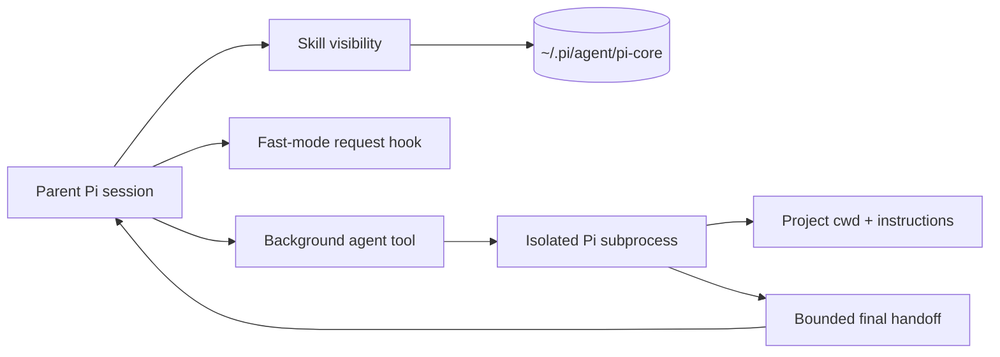

<p align="center">
  <h1 align="center">π Core</h1>
</p>

<p align="center">
  <strong>A lean control layer for the Pi coding agent.</strong>
</p>

<p align="center">
  <a href="https://github.com/enzodevs/pi-core/actions"></a>
  <a href="package.json"></a>
  <a href="LICENSE"></a>
</p>

<p align="center">
  <a href="#quickstart"><strong>Quickstart</strong></a> ·
  <a href="#skill-visibility"><strong>Skills</strong></a> ·
  <a href="#background-agents"><strong>Agents</strong></a> ·
  <a href="#openai-fast-mode"><strong>Fast mode</strong></a> ·
  <a href="CONTEXT-HYGIENE.md"><strong>Context hygiene</strong></a>
</p>

**Pi Core** adds three focused capabilities to [Pi](https://pi.dev): per-project skill visibility, webhook-style background agents, and an OpenAI Codex Fast mode toggle. It is deliberately small, Node-native, and designed around one constraint most agent tooling treats as an afterthought: **everything placed in context has a recurring cost**.

No job dashboard. No polling loop. No sprawling tool catalog. Intermediate work stays outside the parent context, and only bounded, decision-ready results come back.

## Why Pi Core

| Problem | Pi Core's answer |
| --- | --- |
| Every skill inflates every prompt | Choose `full`, `name`, `searchable`, or `off` per working directory |
| Delegated work blocks the conversation | Start isolated Pi agents and push their result back when complete |
| Child transcripts pollute the parent | Return only the final handoff, capped at 12 KiB |
| Project agents miss local instructions | Launch children with an explicit `cwd` so Pi discovers project context |
| Fast mode requires restarting or hidden config | Toggle priority processing live with `/fast` |
| Tool catalogs grow without discipline | Enforce a written context-hygiene policy for schemas and outputs |

## Highlights

- **Exact-CWD skill profiles** — sessions in the same directory share one visibility policy.
- **Searchable skill catalog** — hide metadata from the prompt while retaining on-demand discovery.
- **True background delegation** — child Pi processes return immediately and report completion through the parent session.
- **Isolated agent context** — child reasoning, file reads, tool calls, usage events, and JSON streams never enter the parent conversation.
- **Evidence-first review** — the bundled reviewer uses deterministic scope, complete changed-file accounting, candidate falsification, and a validated evidence ledger.
- **Provider-scoped Fast mode** — injects `service_tier: "priority"` only for OAuth-backed `openai-codex` requests.
- **Node-first TypeScript** — no Bun runtime APIs and no runtime framework beyond Pi's extension surface.

## Quickstart

### Requirements

- Node.js 20 or newer
- A working Pi installation

### Install from GitHub

```bash
pi install git:github.com/enzodevs/pi-core
```

Reload an existing Pi session after installation:

```text
/reload
```

For local development:

```bash
git clone https://github.com/enzodevs/pi-core.git
cd pi-core
npm install
pi install "$PWD"
```

Pi Core stores mutable state under `~/.pi/agent/pi-core/`. It never modifies discovered skill files.

## Skill visibility

Pi Core controls how much information each skill contributes to the model context for each exact working directory.

| Mode | Always-visible context | Searchable | Loadable |
| --- | --- | :---: | :---: |
| `full` | Name, description, and location | ✓ | ✓ |
| `name` | Name only | ✓ | ✓ |
| `searchable` | Nothing | ✓ | ✓ |
| `off` | Nothing | — | — |

Open the interactive manager:

```text
/skill-manager
```

Or update one skill directly:

```text
/skill-manager evidence-first-code-review searchable
```

The model receives two compact tools for enabled skills:

- `search_skills` — search capability metadata without exposing the whole catalog.
- `load_skill` — load one exact skill when its full procedure is needed.

Profiles and the generated metadata index live at:

```text
~/.pi/agent/pi-core/skill-manager.json
~/.pi/agent/pi-core/skill-index.json
```

## Background agents

The `background_agent` tool delegates independent work without blocking the parent session.

```text
Parent Pi
  └─ background_agent returns immediately
       └─ isolated `pi --mode json --no-session` child
            └─ concise completion pushed into the parent
```

The tool intentionally has only three parameters:

| Parameter | Purpose |
| --- | --- |
| `agent` | `scout`, `planner`, `reviewer`, `worker`, or a user-defined agent |
| `task` | Independent work to perform |
| `cwd` | Optional child working directory; defaults to the parent CWD |

Starting the child in `cwd` makes Pi discover that project's `AGENTS.md`/`CLAUDE.md`, settings, skills, extensions, and relative paths. Multiple calls run concurrently. Read-only agents may safely share a directory; parallel writers should receive separate Git worktrees.

When a child finishes, Pi Core injects one bounded completion message and triggers the next safe turn. There is no polling API or user-facing job ceremony. Active children are terminated when the parent session shuts down.

### Bundled roles

| Agent | Purpose | Tools |
| --- | --- | --- |
| `scout` | Fast repository reconnaissance and compressed handoff | Read-only discovery plus shell inspection |
| `planner` | Concrete implementation planning | Read-only repository tools |
| `reviewer` | Evidence-first changed-code review | Read-only repository tools and deterministic review helpers |
| `worker` | Autonomous implementation in an isolated context | Pi defaults |

User agents in `~/.pi/agent/agents/*.md` override bundled agents with the same name. Each child inherits the parent's active model and thinking level unless its agent definition pins a model.

## Evidence-first review

The reviewer ships with its complete review procedure and Python standard-library helpers. It does more than summarize a diff:

1. Freezes the requested commit, staged, or working-tree scope.
2. Accounts for every changed file and applicable repository instruction.
3. Generates candidate failures and actively searches for counterevidence.
4. Separates severity from confidence and reports only validated findings.
5. Machine-checks an evidence ledger before rendering the report.
6. Cleans temporary review artifacts after delivery.

The target repository remains read-only unless a separate worker is explicitly asked to implement fixes.

## OpenAI Fast mode

Toggle priority processing for the OAuth-backed `openai-codex` provider without restarting the session:

```text
/fast          # toggle
/fast on       # enable
/fast off      # disable
/fast status   # inspect
```

When enabled, subsequent Codex requests include:

```json
{
  "service_tier": "priority"
}
```

The official OpenAI Codex implementation uses the same request value for Fast mode. Pi Core applies it only when the active provider is `openai-codex`; other providers remain untouched. Priority processing may incur premium pricing.

State persists at:

```text
~/.pi/agent/pi-core/fast-mode.json
```

## Context hygiene

[`CONTEXT-HYGIENE.md`](./CONTEXT-HYGIENE.md) is an engineering contract, not an aspirational note. It adapts agent-interface principles from [AXI](https://axi.md/) to Pi extensions:

- minimize always-on schemas;
- keep intermediate work outside model context;
- truncate variable output with explicit size hints;
- pre-compute useful aggregates;
- push completion instead of polling;
- use compact formats when measurement justifies them;
- return conclusions rather than transcripts.

## Architecture



## Development

```bash
npm install
npm run check
```

`npm run check` runs:

- Biome formatting and lint checks
- strict TypeScript compilation
- Vitest unit tests

Runtime source is loaded directly by Pi's TypeScript loader. Package releases include only extensions, documentation, and the license.

## License

[MIT](LICENSE) © Enzo Cambraia
